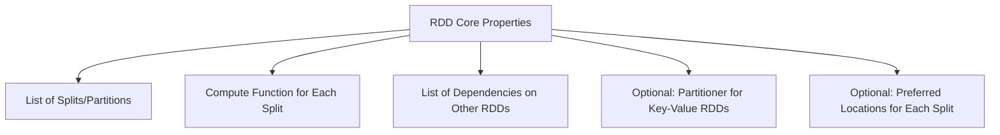
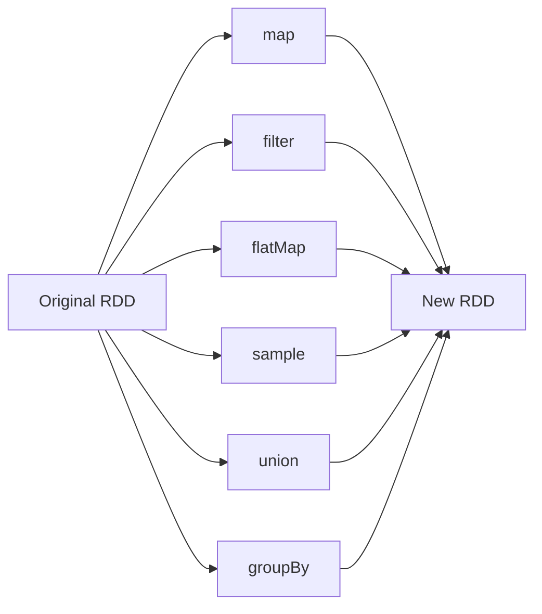
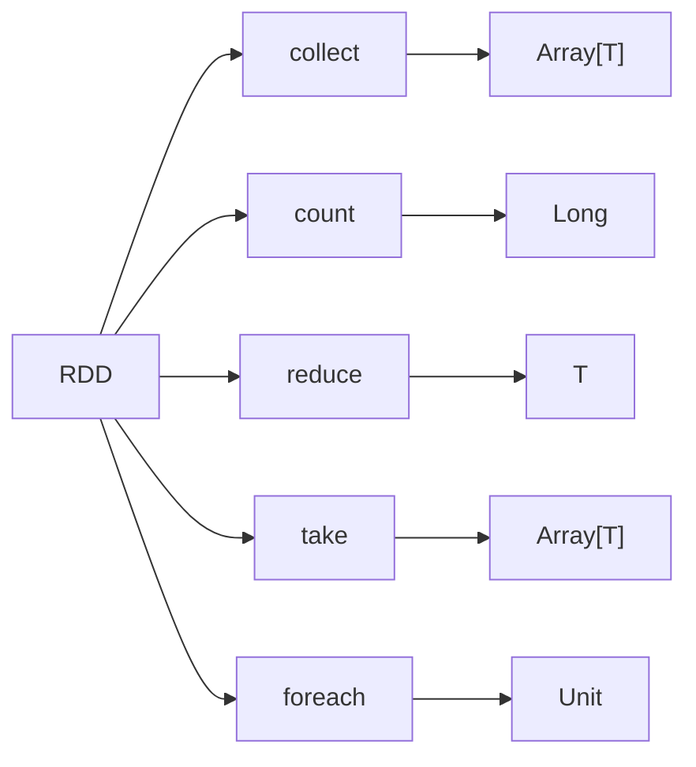
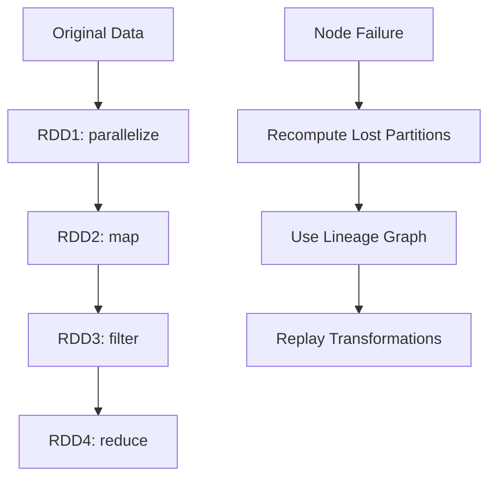
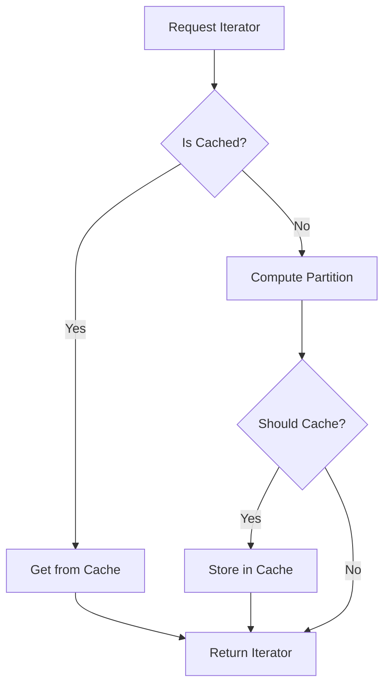

# RDD Fundamentals - The Foundation of Apache Spark

## What is an RDD?

**RDD (Resilient Distributed Dataset)** is the fundamental data structure in Apache Spark. It's an immutable, distributed collection of objects that can be operated on in parallel across a cluster.

### Key Characteristics

1. **Resilient**: Fault-tolerant - can recover from node failures
2. **Distributed**: Data is partitioned across multiple nodes
3. **Dataset**: A collection of data objects
4. **Immutable**: Cannot be modified after creation
5. **Lazily Evaluated**: Transformations are not executed until an action is called

## The Five Core Properties of RDD

According to the source code in `RDD.scala:31-37`, every RDD is characterized by five main properties:



### 1. Splits (Partitions)
- Data is divided into logical chunks called splits/partitions
- Each partition can be processed independently
- Defined by: `def splits: Array[Split]`

### 2. Compute Function
- Function that computes each partition's data
- Core method: `def compute(split: Split): Iterator[T]`
- Returns an iterator over the elements in the partition

### 3. Dependencies
- Tracks relationships between RDDs
- Enables fault tolerance through lineage tracking
- Defined by: `val dependencies: List[Dependency[_]]`

### 4. Partitioner (Optional)
- For key-value RDDs, specifies how data is partitioned
- Examples: Hash partitioning, range partitioning
- Defined by: `val partitioner: Option[Partitioner] = None`

### 5. Preferred Locations (Optional)
- Hints about where to compute each partition
- Enables data locality optimization
- Defined by: `def preferredLocations(split: Split): Seq[String] = Nil`

## RDD Class Structure

```scala
abstract class RDD[T: ClassManifest](@transient sc: SparkContext) extends Serializable
```

### Key Components:

- **Generic Type `T`**: The type of elements in the RDD
- **ClassManifest**: Scala's way to preserve type information at runtime
- **@transient sc**: Reference to SparkContext (not serialized)
- **Serializable**: RDD can be sent across the network

## RDD Operations

RDDs support two types of operations:

### 1. Transformations (Lazy)
Create new RDDs from existing ones. Examples from `RDD.scala`:



Key transformations:
- `map[U](f: T => U): RDD[U]` - Transform each element
- `filter(f: T => Boolean): RDD[T]` - Filter elements
- `flatMap[U](f: T => TraversableOnce[U]): RDD[U]` - Map and flatten
- `union(other: RDD[T]): RDD[T]` - Combine RDDs
- `groupBy[K](f: T => K): RDD[(K, Seq[T])]` - Group by key

### 2. Actions (Eager)
Trigger computation and return results. Examples:



Key actions:
- `collect(): Array[T]` - Return all elements as array
- `count(): Long` - Count number of elements
- `reduce(f: (T, T) => T): T` - Reduce elements to single value
- `take(num: Int): Array[T]` - Take first num elements
- `foreach(f: T => Unit)` - Apply function to each element

## RDD Lineage and Fault Tolerance



### How Fault Tolerance Works:
1. **Lineage Graph**: Chain of transformations is recorded
2. **Partition Loss**: If a partition is lost due to node failure
3. **Recomputation**: Spark uses the lineage to recompute only lost partitions
4. **Minimal Recovery**: Only affected partitions are recomputed, not entire dataset

## Caching and Persistence

```scala
// From RDD.scala:64-80
private var shouldCache = false

def cache(): RDD[T] = {
  shouldCache = true
  this
}

final def iterator(split: Split): Iterator[T] = {
  if (shouldCache) {
    SparkEnv.get.cacheTracker.getOrCompute[T](this, split)
  } else {
    compute(split)
  }
}
```

### Caching Flow:


## RDD Implementation Examples

### MappedRDD
```scala
class MappedRDD[U: ClassManifest, T: ClassManifest](
    prev: RDD[T],
    f: T => U)
  extends RDD[U](prev.context) {
  
  override def splits = prev.splits
  override val dependencies = List(new OneToOneDependency(prev))
  override def compute(split: Split) = prev.iterator(split).map(f)
}
```

### FilteredRDD  
```scala
class FilteredRDD[T: ClassManifest](prev: RDD[T], f: T => Boolean) 
  extends RDD[T](prev.context) {
  
  override def splits = prev.splits
  override val dependencies = List(new OneToOneDependency(prev))
  override def compute(split: Split) = prev.iterator(split).filter(f)
}
```

## Key Insights

1. **Immutability**: RDDs are immutable - transformations create new RDDs
2. **Lazy Evaluation**: Transformations are not executed until an action is called
3. **Lineage Tracking**: Dependencies enable fault tolerance without replication
4. **Partition-based**: All operations work on partitions for parallelism
5. **Type Safety**: Strong typing with ClassManifest for runtime type information

## Next Steps

- Understanding SparkContext and how RDDs are created
- Exploring the scheduling system that executes RDD operations
- Deep dive into specific RDD implementations (HadoopRDD, ParallelCollectionRDD, etc.)