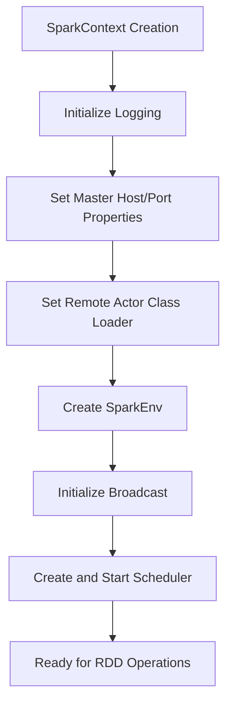
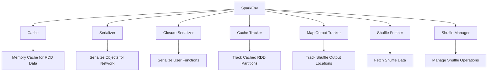
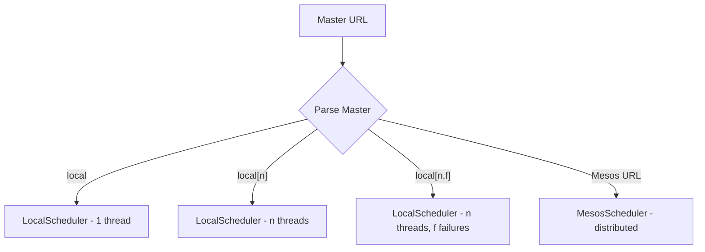
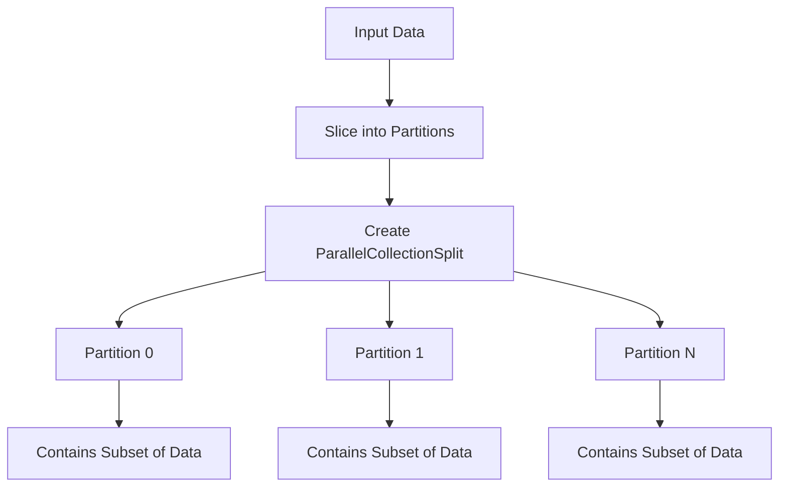
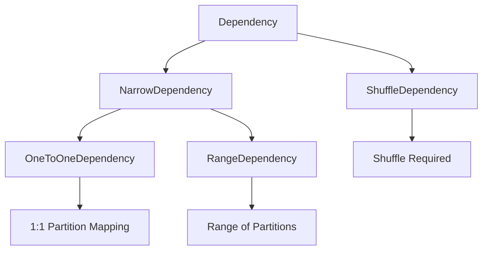
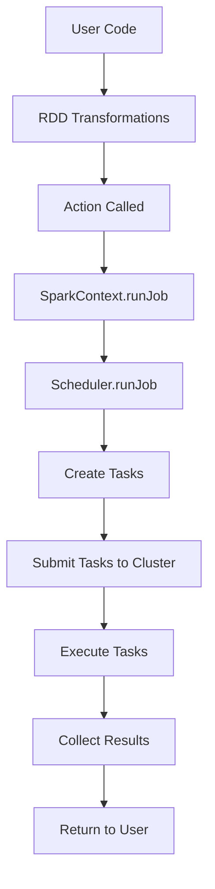

# SparkContext and Core Components

## SparkContext - The Entry Point

**SparkContext** is the main entry point for all Spark functionality. It represents the connection to a Spark cluster and coordinates the execution of operations across the cluster.

### SparkContext Creation

```scala
class SparkContext(
    master: String,
    frameworkName: String,
    val sparkHome: String = null,
    val jars: Seq[String] = Nil)
  extends Logging
```

### Key Parameters:
- **master**: Where to connect (local, local[n], or mesos URL)
- **frameworkName**: Name for the Spark application
- **sparkHome**: Location of Spark installation (optional)
- **jars**: Additional JAR files to distribute (optional)

## SparkContext Initialization Flow



### Initialization Steps (from `SparkContext.scala:42-82`):

1. **Logging Setup**: Initialize logging system
2. **System Properties**: Set default master host/port
3. **Remote Actors**: Configure class loader for distributed operations
4. **SparkEnv**: Create execution environment
5. **Broadcast**: Initialize broadcast system
6. **Scheduler**: Create and start appropriate scheduler

## SparkEnv - The Execution Environment

**SparkEnv** contains all the services needed for Spark execution:

```scala
class SparkEnv (
  val cache: Cache,
  val serializer: Serializer,
  val closureSerializer: Serializer,
  val cacheTracker: CacheTracker,
  val mapOutputTracker: MapOutputTracker,
  val shuffleFetcher: ShuffleFetcher,
  val shuffleManager: ShuffleManager
)
```

### SparkEnv Components:



## Scheduler Selection

SparkContext automatically selects the appropriate scheduler based on the master URL:

```scala
private var scheduler: Scheduler = {
  val LOCAL_N_REGEX = """local\[([0-9]+)\]""".r
  val LOCAL_N_FAILURES_REGEX = """local\[([0-9]+),([0-9]+)\]""".r
  master match {
    case "local" => 
      new LocalScheduler(1, 0)
    case LOCAL_N_REGEX(threads) => 
      new LocalScheduler(threads.toInt, 0)
    case LOCAL_N_FAILURES_REGEX(threads, maxFailures) =>
      new LocalScheduler(threads.toInt, maxFailures.toInt)
    case _ =>
      MesosNativeLibrary.load()
      new MesosScheduler(this, master, frameworkName)
  }
}
```

### Scheduler Types:



## RDD Creation Methods

SparkContext provides several methods for creating RDDs:

### 1. Parallelizing Collections

```scala
def parallelize[T: ClassManifest](seq: Seq[T], numSlices: Int): RDD[T] = {
  new ParallelCollection[T](this, seq, numSlices)
}
```

**Example Usage:**
```scala
val data = Array(1, 2, 3, 4, 5)
val rdd = sc.parallelize(data, 2) // 2 partitions
```

### 2. Reading Text Files

```scala
def textFile(path: String, minSplits: Int): RDD[String] = {
  hadoopFile(path, classOf[TextInputFormat], classOf[LongWritable], classOf[Text], minSplits)
    .map(pair => pair._2.toString)
}
```

### 3. Reading Hadoop Files

```scala
def hadoopFile[K, V](
    path: String,
    inputFormatClass: Class[_ <: InputFormat[K, V]],
    keyClass: Class[K],
    valueClass: Class[V],
    minSplits: Int): RDD[(K, V)] = {
  // Create JobConf and HadoopRDD
  val conf = new JobConf()
  FileInputFormat.setInputPaths(conf, path)
  new HadoopRDD(this, conf, inputFormatClass, keyClass, valueClass, minSplits)
}
```

## ParallelCollection - In-Memory RDD

**ParallelCollection** is the simplest RDD implementation, representing data already in memory:

```scala
class ParallelCollection[T: ClassManifest](
    sc: SparkContext, 
    @transient data: Seq[T],
    numSlices: Int)
  extends RDD[T](sc)
```

### Key Features:
- **@transient data**: Original data not serialized (exists only on driver)
- **Splits**: Data is divided into partitions using intelligent slicing
- **No Dependencies**: Root RDD with no parent dependencies

### Partition Creation:



### Intelligent Slicing:

The `ParallelCollection.slice()` method handles different collection types efficiently:

- **Range**: Creates sub-ranges without materializing all elements
- **NumericRange**: Handles Long, Double, BigInteger ranges
- **General Collections**: Converts to array for efficient slicing

## RDD Dependencies

Dependencies track relationships between RDDs and enable fault tolerance:

```scala
abstract class Dependency[T](val rdd: RDD[T], val isShuffle: Boolean) extends Serializable
```

### Dependency Types:



#### 1. NarrowDependency
- Each partition depends on a small number of parent partitions
- No shuffle required
- Examples: map, filter, union

#### 2. ShuffleDependency  
- Partitions depend on all parent partitions
- Shuffle required
- Examples: groupByKey, reduceByKey

### OneToOneDependency Example:
```scala
class OneToOneDependency[T](rdd: RDD[T]) extends NarrowDependency[T](rdd) {
  override def getParents(partitionId: Int) = List(partitionId)
}
```

## Job Execution Flow



## Key Concepts

### 1. Lazy Evaluation
- Transformations are not executed immediately
- Only executed when an action is called
- Allows for optimization of the entire computation graph

### 2. Lineage Tracking
- RDD dependencies form a directed acyclic graph (DAG)
- Enables fault tolerance without replication
- Lost partitions can be recomputed from their dependencies

### 3. Partitioning
- Data is divided into partitions for parallel processing
- Each partition is processed independently
- Optimal partition size balances parallelism and overhead

### 4. Caching
- RDDs can be cached in memory for reuse
- Avoids recomputation of expensive operations
- Configurable storage levels (memory, disk, serialized)

## Next Steps

- Understanding the task scheduling system
- Deep dive into specific RDD implementations
- Exploring shuffle operations and optimization strategies