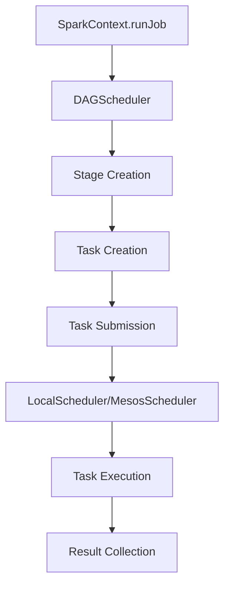
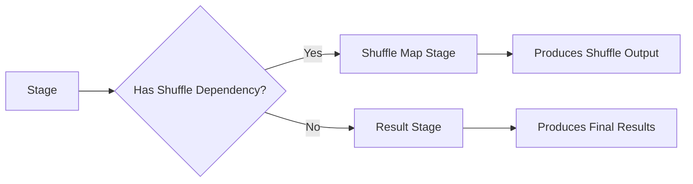
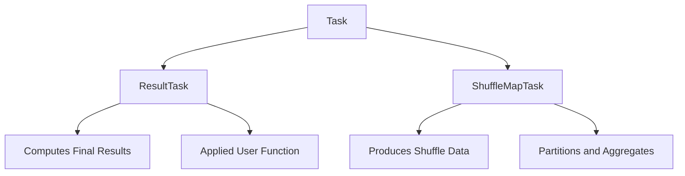
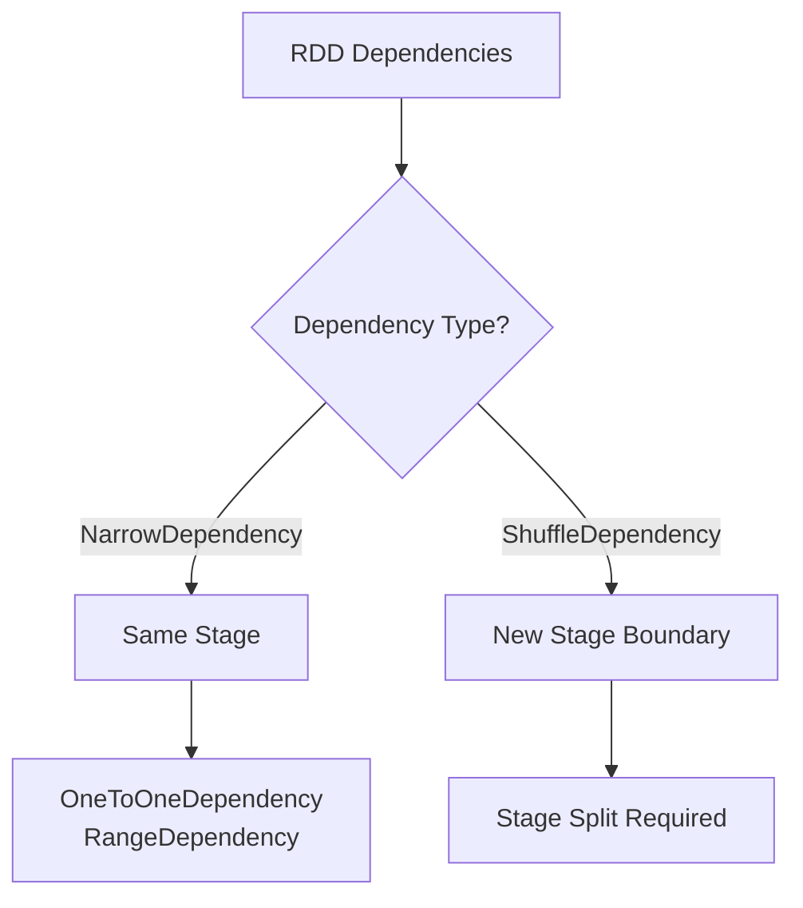
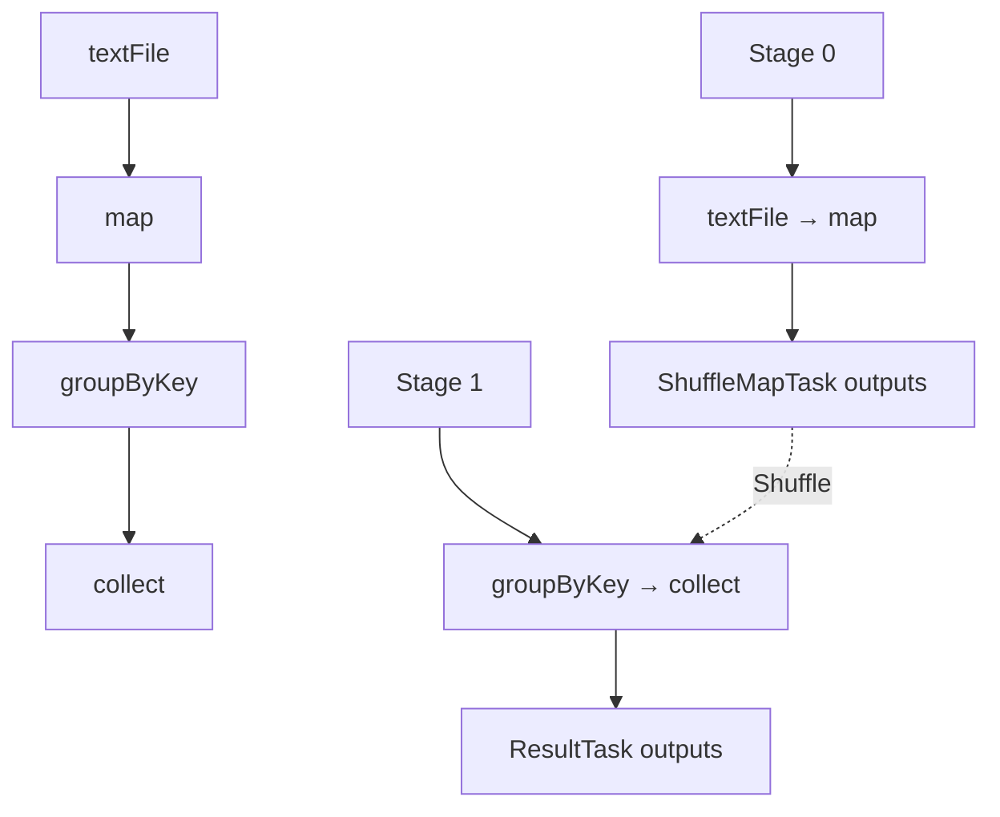
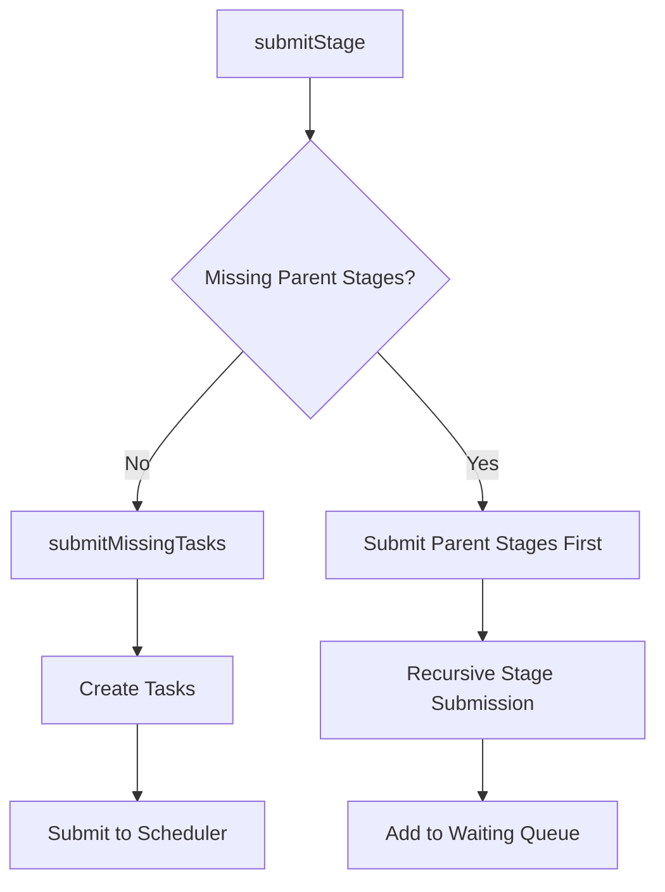
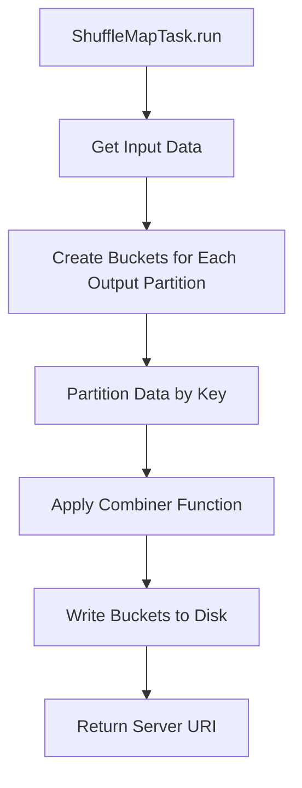
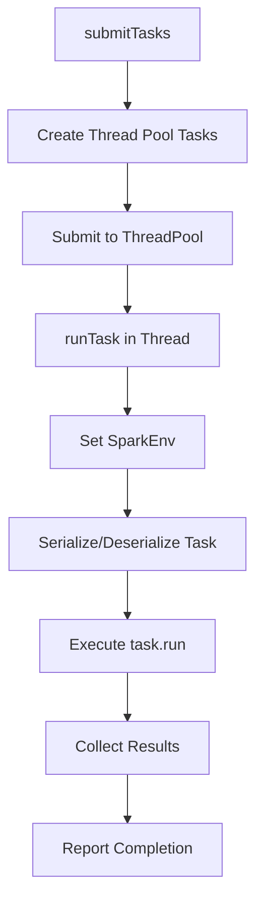
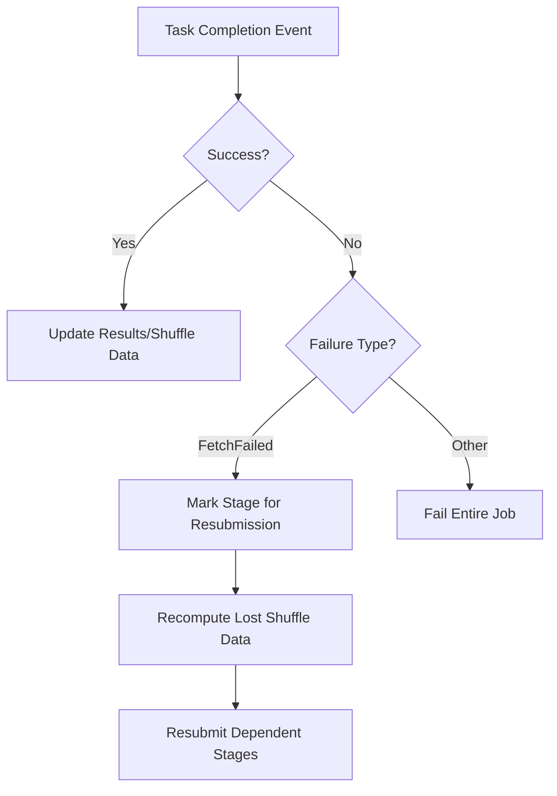

# Spark Scheduling and Task Execution

## Overview

Spark's scheduling system is responsible for converting RDD operations into executable tasks and coordinating their execution across the cluster. The system is built around a **stage-oriented scheduler** that creates a DAG (Directed Acyclic Graph) of stages.

## Key Components



## DAGScheduler - The Heart of Scheduling

**DAGScheduler** implements stage-oriented scheduling and is responsible for:
- Creating a DAG of stages for each job
- Tracking which RDDs and stage outputs are materialized
- Computing a minimal schedule to run the job
- Handling task failures and resubmission

### Core Abstractions

#### 1. Stages
A **Stage** represents a set of tasks that can be executed in parallel:

```scala
class Stage(
    val id: Int,
    val rdd: RDD[_],
    val shuffleDep: Option[ShuffleDependency[_,_,_]],
    val parents: List[Stage])
```

**Stage Types:**
- **Shuffle Map Stage**: Produces input for shuffle operations
- **Result Stage**: Final stage that produces results for the user



#### 2. Tasks
Tasks are the actual work units executed on cluster nodes:

```scala
abstract class Task[T] extends Serializable {
  def run(id: Int): T
  def preferredLocations: Seq[String] = Nil
  def generation: Option[Long] = None
}
```

**Task Types:**



## Stage Creation Process

### 1. Stage Boundary Detection

Stages are created at **shuffle boundaries**. The DAGScheduler analyzes RDD dependencies to determine stage boundaries:



### 2. Stage Graph Construction

```scala
def getParentStages(rdd: RDD[_]): List[Stage] = {
  val parents = new HashSet[Stage]
  val visited = new HashSet[RDD[_]]
  def visit(r: RDD[_]) {
    for (dep <- r.dependencies) {
      dep match {
        case shufDep: ShuffleDependency[_,_,_] =>
          parents += getShuffleMapStage(shufDep)  // Stage boundary
        case _ =>
          visit(dep.rdd)  // Continue in same stage
      }
    }
  }
  visit(rdd)
  parents.toList
}
```

### Example: Stage Creation for groupByKey



## Task Execution Flow

### 1. Job Submission

```scala
override def runJob[T, U](
    finalRdd: RDD[T],
    func: (TaskContext, Iterator[T]) => U,
    partitions: Seq[Int],
    allowLocal: Boolean): Array[U] = {
  
  val runId = nextRunId.getAndIncrement()
  val finalStage = newStage(finalRdd, None)
  
  // Submit stages recursively
  submitStage(finalStage)
  
  // Wait for completion
  while (numFinished != numOutputParts) {
    // Process completion events
  }
}
```

### 2. Stage Submission Strategy

```scala
def submitStage(stage: Stage) {
  if (!waiting(stage) && !running(stage)) {
    val missing = getMissingParentStages(stage)
    if (missing == Nil) {
      submitMissingTasks(stage)  // Submit this stage
      running += stage
    } else {
      for (parent <- missing) {
        submitStage(parent)       // Submit parent stages first
      }
      waiting += stage
    }
  }
}
```

### Stage Submission Flow



## Task Types Deep Dive

### ResultTask

**Purpose**: Execute the final computation and return results to the driver

```scala
class ResultTask[T, U](
    runId: Int,
    stageId: Int, 
    rdd: RDD[T], 
    func: (TaskContext, Iterator[T]) => U,
    partition: Int, 
    locs: Seq[String],
    outputId: Int) extends DAGTask[U]
```

**Execution**:
```scala
override def run(attemptId: Int): U = {
  val context = new TaskContext(stageId, partition, attemptId)
  func(context, rdd.iterator(split))  // Apply user function
}
```

### ShuffleMapTask

**Purpose**: Partition and write data for shuffle operations

```scala
class ShuffleMapTask(
    runId: Int,
    stageId: Int,
    rdd: RDD[_], 
    dep: ShuffleDependency[_,_,_],
    partition: Int, 
    locs: Seq[String]) extends DAGTask[String]
```

**Execution Process**:



**Key Steps**:
1. **Bucket Creation**: One bucket per output partition
2. **Partitioning**: Use partitioner to assign keys to buckets
3. **Aggregation**: Apply combiner function for efficiency
4. **Serialization**: Write buckets to disk files
5. **Location Tracking**: Return server URI for shuffle fetch

```scala
override def run(attemptId: Int): String = {
  val numOutputSplits = dep.partitioner.numPartitions
  val buckets = Array.tabulate(numOutputSplits)(_ => new JHashMap[Any, Any])
  
  // Partition and aggregate data
  for (elem <- rdd.iterator(split)) {
    val (k, v) = elem.asInstanceOf[(Any, Any)]
    val bucketId = partitioner.getPartition(k)
    val bucket = buckets(bucketId)
    // Apply combiner function
    bucket.put(k, aggregator.mergeValue(existing, v))
  }
  
  // Write buckets to shuffle files
  for (i <- 0 until numOutputSplits) {
    val file = shuffleManager.getOutputFile(shuffleId, partition, i)
    // Serialize and write bucket data
  }
  
  return shuffleManager.getServerUri
}
```

## LocalScheduler - Single Machine Execution

**LocalScheduler** implements task execution on a single machine using a thread pool:

```scala
private class LocalScheduler(threads: Int, maxFailures: Int) extends DAGScheduler
```

### Task Execution Process



### Key Features:
- **Thread Pool**: Fixed-size thread pool for parallel execution
- **Fault Tolerance**: Configurable task retry on failure
- **Serialization**: Tasks are serialized/deserialized to simulate cluster behavior
- **Environment Setup**: Each thread gets proper SparkEnv setup

## Fault Tolerance and Recovery

### 1. Task Failure Handling



### 2. Shuffle Failure Recovery

When a shuffle fetch fails:
1. **Mark Failed Stage**: The stage consuming shuffle data is marked as failed
2. **Find Source Stage**: Identify the stage that produced the lost shuffle data
3. **Resubmit Stages**: Recompute the shuffle map stage and dependent stages
4. **Update Tracking**: Remove stale location information

### 3. Cache Invalidation

```scala
case FetchFailed(serverUri, shuffleId, mapId, reduceId) =>
  val mapStage = shuffleToMapStage(shuffleId)
  mapStage.removeOutputLoc(mapId, serverUri)
  mapOutputTracker.unregisterMapOutput(shuffleId, mapId, serverUri)
```

## Optimization Strategies

### 1. Local Execution Optimization

```scala
// Short-circuit for simple operations
if (allowLocal && finalStage.parents.size == 0 && numOutputParts == 1) {
  logInfo("Computing the requested partition locally")
  val split = finalRdd.splits(outputParts(0))
  val taskContext = new TaskContext(finalStage.id, outputParts(0), 0)
  return Array(func(taskContext, finalRdd.iterator(split)))
}
```

### 2. Preferred Locations

The scheduler considers data locality when placing tasks:

```scala
def getPreferredLocs(rdd: RDD[_], partition: Int): List[String] = {
  // 1. Check cache locations
  val cached = getCacheLocs(rdd)(partition)
  if (cached != Nil) return cached
  
  // 2. Check RDD preferred locations (e.g., HDFS block locations)
  val rddPrefs = rdd.preferredLocations(rdd.splits(partition))
  if (rddPrefs != Nil) return rddPrefs
  
  // 3. Check narrow dependency locations
  // Recursively check parent RDD locations
}
```

### Data Locality Priority:
1. **Cache locations** (fastest)
2. **RDD preferred locations** (e.g., HDFS blocks)
3. **Parent RDD locations** (for narrow dependencies)

## Performance Characteristics

### Stage Parallelism
- Each stage can execute multiple tasks in parallel
- Parallelism is limited by the number of partitions
- Tasks within a stage are independent

### Pipeline Efficiency
- Narrow transformations can be pipelined within a single task
- Reduces intermediate data materialization
- Minimizes network communication

### Memory Management
- Tasks operate on iterators to minimize memory usage
- Spilling to disk when memory is exhausted
- Configurable memory fractions for different components

## Next Steps

- Understanding shuffle operations and data exchange
- Exploring caching and persistence mechanisms
- Analyzing specific RDD implementations and their optimizations