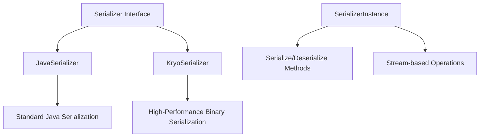
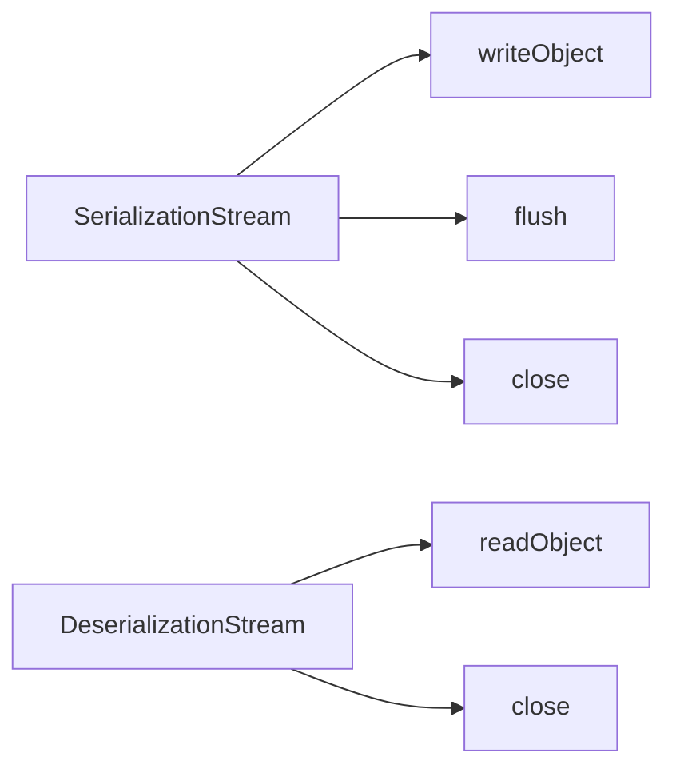
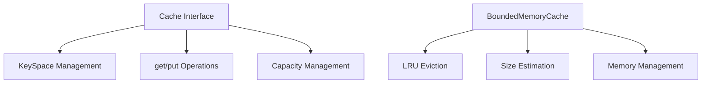
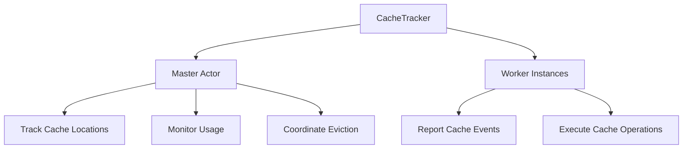

# Serialization and Caching in Apache Spark

## Overview

Serialization and caching are fundamental components that enable Spark's distributed computing capabilities. Serialization allows data and functions to be sent across the network, while caching provides in-memory storage for frequently accessed data.

## Serialization Architecture

### Serialization Framework

Spark uses a pluggable serialization framework with multiple implementations:



### Core Interfaces

#### 1. Serializer
```scala
trait Serializer {
  def newInstance(): SerializerInstance
}
```

**Purpose**: Factory for creating thread-safe serializer instances

#### 2. SerializerInstance
```scala
trait SerializerInstance {
  def serialize[T](t: T): Array[Byte]
  def deserialize[T](bytes: Array[Byte]): T
  def deserialize[T](bytes: Array[Byte], loader: ClassLoader): T
  def outputStream(s: OutputStream): SerializationStream
  def inputStream(s: InputStream): DeserializationStream
}
```

**Purpose**: Thread-local instance that performs actual serialization

### Serialization Streams



## Java Serialization

### Implementation

```scala
class JavaSerializer extends Serializer {
  def newInstance(): SerializerInstance = new JavaSerializerInstance
}

class JavaSerializerInstance extends SerializerInstance {
  def serialize[T](t: T): Array[Byte] = {
    val bos = new ByteArrayOutputStream()
    val out = new ObjectOutputStream(bos)
    out.writeObject(t)
    out.close()
    bos.toByteArray
  }
}
```

### Key Features:
- **Simple**: Uses standard Java serialization mechanism
- **Compatibility**: Works with any Serializable class
- **Performance**: Slower and produces larger output compared to Kryo
- **Class Resolution**: Custom class loader support for distributed environments

### Custom ObjectInputStream
```scala
val objIn = new ObjectInputStream(in) {
  override def resolveClass(desc: ObjectStreamClass) =
    Class.forName(desc.getName, false, Thread.currentThread.getContextClassLoader)
}
```

**Purpose**: Ensures classes are loaded with the correct ClassLoader in distributed settings

## Kryo Serialization

### High-Performance Binary Serialization

**KryoSerializer** provides significantly better performance than Java serialization:

```scala
class KryoSerializer extends Serializer with Logging {
  val kryo = createKryo()
  val bufferSize = System.getProperty("spark.kryoserializer.buffer.mb", "2").toInt * 1024 * 1024 
  
  val threadBuf = new ThreadLocal[ObjectBuffer] {
    override def initialValue = new ObjectBuffer(kryo, bufferSize)
  }
}
```

### Key Optimizations:

#### 1. Thread-Local Buffers
```scala
val threadBuf = new ThreadLocal[ObjectBuffer]
val threadByteBuf = new ThreadLocal[ByteBuffer]
```

**Benefits**:
- Eliminates buffer allocation overhead
- Thread-safe without synchronization
- Reuses memory across serialization operations

#### 2. Class Registration
```scala
val toRegister: Seq[AnyRef] = Seq(
  Array(1), Array(1.0), Array(""),  // Common arrays
  ("", ""), (1, 1), (1.0, 1.0),    // Tuples
  List(1), mutable.ArrayBuffer(1),  // Collections
  Some(1), Left(1), Right(1)       // Options and Either
)
for (obj <- toRegister) {
  kryo.register(obj.getClass)
}
```

#### 3. Singleton Object Handling
```scala
class SingletonSerializer(obj: AnyRef) extends KSerializer {
  override def writeObjectData(buf: ByteBuffer, obj: AnyRef) {}
  override def readObjectData[T](buf: ByteBuffer, cls: Class[T]): T = obj.asInstanceOf[T]
}
kryo.register(None.getClass, new SingletonSerializer(None))
kryo.register(Nil.getClass, new SingletonSerializer(Nil))
```

**Purpose**: Preserves object identity for Scala singletons

#### 4. ZigZag Encoding
```scala
object ZigZag {
  def writeInt(n: Int, out: OutputStream) {
    // Variable-length integer encoding
    var value = n
    if ((value & ~0x7F) == 0) {
      out.write(value)
      return
    }
    // Continue encoding in 7-bit chunks
  }
}
```

**Benefits**: Compact representation for small integers

## Caching System Architecture

### Cache Abstraction



### Cache Interface Design

```scala
abstract class Cache {
  def get(datasetId: Any, partition: Int): Any
  def put(datasetId: Any, partition: Int, value: Any): CachePutResponse
  def getCapacity: Long = 0L
}
```

### KeySpace Isolation

```scala
class KeySpace(cache: Cache, val keySpaceId: Int) {
  def get(datasetId: Any, partition: Int): Any =
    cache.get((keySpaceId, datasetId), partition)
}
```

**Purpose**: Separate namespaces for RDD cache, broadcast variables, etc.

## BoundedMemoryCache Implementation

### Memory-Aware Caching

```scala
class BoundedMemoryCache(maxBytes: Long) extends Cache with Logging {
  private var currentBytes = 0L
  private val map = new LinkedHashMap[(Any, Int), Entry](32, 0.75f, true)
  
  override def put(datasetId: Any, partition: Int, value: Any): CachePutResponse = {
    val size = estimateValueSize(key, value)
    if (ensureFreeSpace(datasetId, size)) {
      map.put(key, new Entry(value, size))
      currentBytes += size
      CachePutSuccess(size)
    } else {
      CachePutFailure()
    }
  }
}
```

### Key Features:

#### 1. Size Estimation
```scala
private def estimateValueSize(key: (Any, Int), value: Any) = {
  val size = SizeEstimator.estimate(value.asInstanceOf[AnyRef])
  size
}
```

**Purpose**: Estimates memory usage to enforce cache limits

#### 2. LRU Eviction Policy
```scala
private def ensureFreeSpace(datasetId: Any, space: Long): Boolean = {
  val iter = map.entrySet.iterator   // LRU order
  while (maxBytes - currentBytes < space && iter.hasNext) {
    val mapEntry = iter.next()
    val (entryDatasetId, entryPartition) = mapEntry.getKey
    if (entryDatasetId == datasetId) {
      return false  // Don't evict same dataset
    }
    currentBytes -= mapEntry.getValue.size
    iter.remove()
  }
  true
}
```

#### 3. Dataset-Aware Eviction
- Never evicts partitions from the same dataset being cached
- Prevents cache thrashing when caching large datasets
- Maintains data locality for iterative algorithms

### Memory Configuration

```scala
object BoundedMemoryCache {
  def getMaxBytes: Long = {
    val memoryFractionToUse = System.getProperty("spark.boundedMemoryCache.memoryFraction", "0.66").toDouble
    (Runtime.getRuntime.maxMemory * memoryFractionToUse).toLong
  }
}
```

**Default**: 66% of JVM heap space

## Cache Tracking System

### Distributed Cache Coordination



### CacheTracker Architecture

```scala
class CacheTracker(isMaster: Boolean, theCache: Cache) extends Logging {
  var trackerActor: AbstractActor = null
  val cache = theCache.newKeySpace()
  
  if (isMaster) {
    val tracker = new CacheTrackerActor
    tracker.start()
    trackerActor = tracker
  } else {
    val host = System.getProperty("spark.master.host")
    val port = System.getProperty("spark.master.port").toInt
    trackerActor = RemoteActor.select(Node(host, port), 'CacheTracker)
  }
}
```

### Cache Events

```scala
sealed trait CacheTrackerMessage
case class AddedToCache(rddId: Int, partition: Int, host: String, size: Long = 0L)
case class DroppedFromCache(rddId: Int, partition: Int, host: String, size: Long = 0L)
case class MemoryCacheLost(host: String)
case class RegisterRDD(rddId: Int, numPartitions: Int)
```

### Master Actor Operations

```scala
case AddedToCache(rddId, partition, host, size) =>
  slaveUsage.put(host, getCacheUsage(host) + size)
  locs(rddId)(partition) = host :: locs(rddId)(partition)
  
case DroppedFromCache(rddId, partition, host, size) =>
  slaveUsage.put(host, getCacheUsage(host) - size)
  locs(rddId)(partition) = locs(rddId)(partition).filterNot(_ == host)
```

## Cache Operations Flow

### getOrCompute Implementation

```scala
def getOrCompute[T](rdd: RDD[T], split: Split): Iterator[T] = {
  val cachedVal = cache.get(rdd.id, split.index)
  if (cachedVal != null) {
    return cachedVal.asInstanceOf[Array[T]].iterator
  }
  
  // Prevent multiple threads from computing the same partition
  val key = (rdd.id, split.index)
  loading.synchronized {
    while (loading.contains(key)) {
      loading.wait()
    }
    loading.add(key)
  }
  
  try {
    array = rdd.compute(split).toArray
    val putResponse = cache.put(rdd.id, split.index, array)
    
    putResponse match {
      case CachePutSuccess(size) =>
        trackerActor !? AddedToCache(rdd.id, split.index, Utils.getHost, size)
      case _ => // Cache put failed
    }
  } finally {
    loading.synchronized {
      loading.remove(key)
      loading.notifyAll()
    }
  }
  
  array.iterator
}
```

### Key Optimizations:

#### 1. Thread Coordination
- Only one thread computes each partition
- Other threads wait for computation to complete
- Prevents redundant computation

#### 2. Atomic Operations
- Cache put and tracker notification are coordinated
- Ensures consistent view across cluster

#### 3. Fallback Handling
- Graceful fallback when cache is full
- Computation proceeds even if caching fails

## Serialization Use Cases

### 1. Task Serialization
```scala
// In LocalScheduler
val ser = SparkEnv.get.closureSerializer.newInstance()
val bytes = ser.serialize(task)
val deserializedTask = ser.deserialize[Task[_]](bytes, classLoader)
```

### 2. Shuffle Data
```scala
// In ShuffleMapTask
val ser = SparkEnv.get.serializer.newInstance()
val out = ser.outputStream(new FileOutputStream(file))
out.writeObject((entry.getKey, entry.getValue))
```

### 3. Broadcast Variables
- Large read-only data distributed to all nodes
- Serialized once, cached on each worker
- Reduces network traffic for shared data

## Performance Considerations

### Serialization Performance

| Serializer | Speed | Output Size | Setup Complexity |
|------------|-------|-------------|------------------|
| Java | Slow | Large | Simple |
| Kryo | Fast | Compact | Moderate |

### Cache Performance

#### Benefits:
- **Iterative Algorithms**: Avoids recomputation
- **Interactive Queries**: Fast access to frequently used data
- **Fault Recovery**: Reduces recovery time

#### Trade-offs:
- **Memory Usage**: Reduces available memory for computation
- **GC Pressure**: Large objects can impact garbage collection
- **Eviction Overhead**: LRU maintenance cost

### Configuration Guidelines

#### Kryo Settings:
```
spark.serializer=spark.KryoSerializer
spark.kryoserializer.buffer.mb=24
spark.kryo.registrator=MyKryoRegistrator
```

#### Cache Settings:
```
spark.boundedMemoryCache.memoryFraction=0.6
spark.cache.class=spark.BoundedMemoryCache
```

## Next Steps

- Understanding shuffle operations and data exchange patterns
- Exploring broadcast variables and accumulator mechanisms
- Analyzing memory management and garbage collection impacts