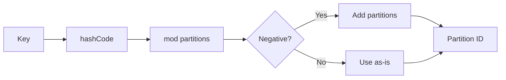
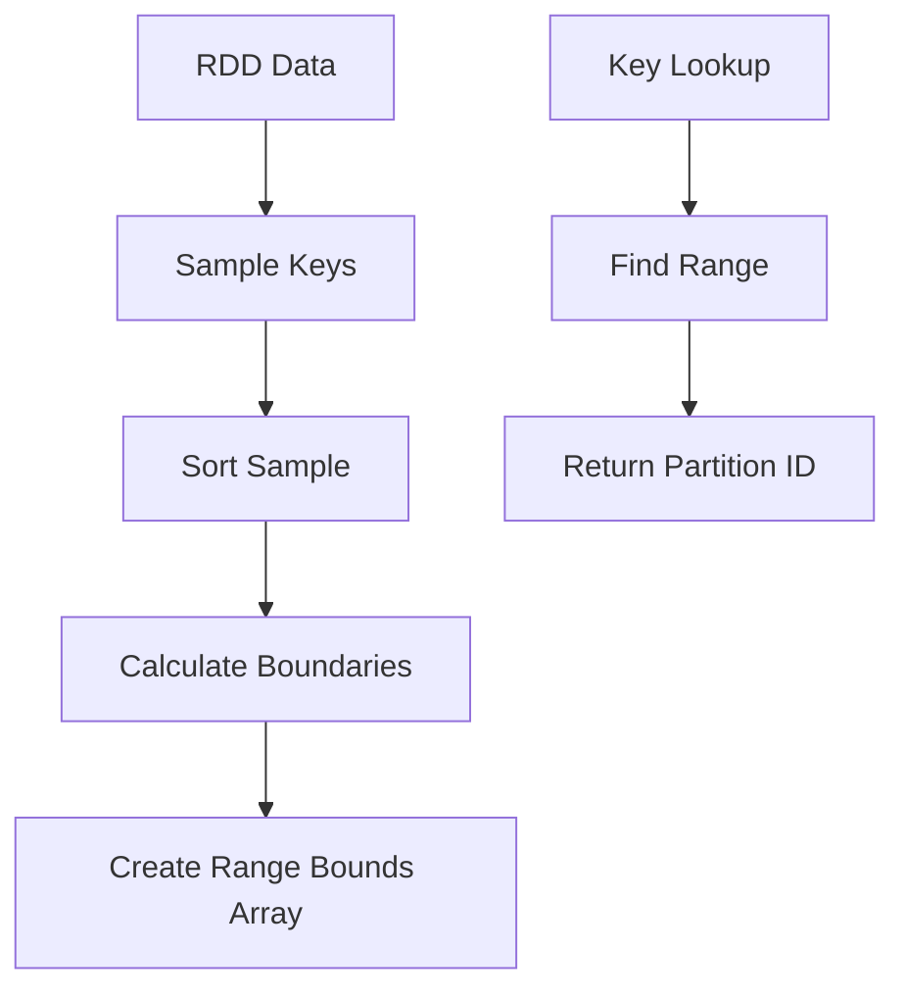
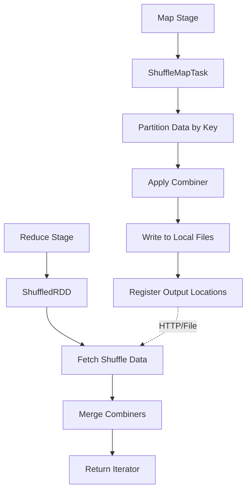
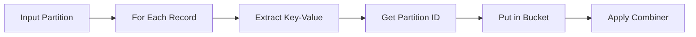
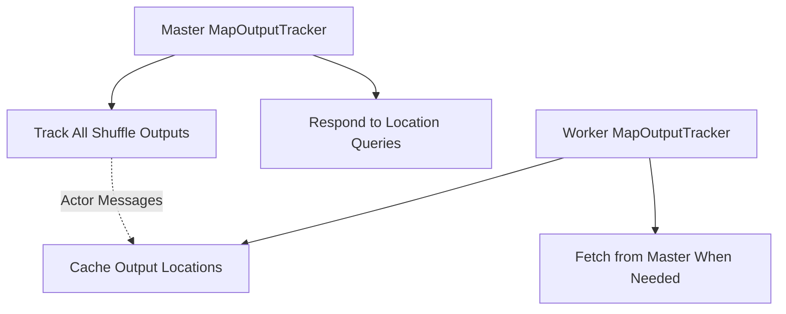
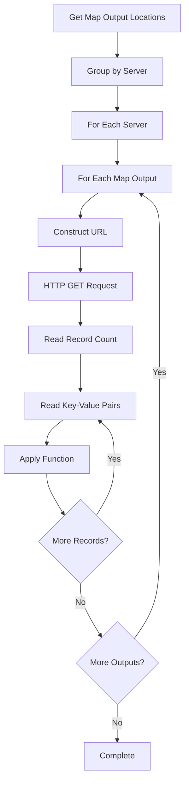

# Shuffle and Partitioning in Apache Spark

## Overview

Shuffle is the process of redistributing data across partitions to enable operations like `groupByKey`, `reduceByKey`, and `join`. It's one of the most expensive operations in Spark as it involves disk I/O, network transfer, and serialization.

## Partitioning Strategy

### Partitioner Interface

```scala
abstract class Partitioner extends Serializable {
  def numPartitions: Int
  def getPartition(key: Any): Int
}
```

**Purpose**: Determines how data is distributed across partitions based on keys

### Hash Partitioning

```scala
class HashPartitioner(partitions: Int) extends Partitioner {
  def numPartitions = partitions

  def getPartition(key: Any): Int = {
    if (key == null) {
      return 0
    } else {
      val mod = key.hashCode % partitions
      if (mod < 0) {
        mod + partitions
      } else {
        mod
      }
    }
  }
}
```

**Key Features:**
- Uses object's `hashCode()` for partitioning
- Handles negative hash codes
- Null keys go to partition 0
- Simple and fast computation



### Range Partitioning

```scala
class RangePartitioner[K <% Ordered[K]: ClassManifest, V](
    partitions: Int,
    rdd: RDD[(K,V)],
    ascending: Boolean = true) extends Partitioner
```

**Purpose**: Partitions data by key ranges, ensuring sorted order within partitions

#### Range Bounds Calculation

```scala
private val rangeBounds: Array[K] = {
  if (partitions == 1) {
    Array()
  } else {
    val rddSize = rdd.count()
    val maxSampleSize = partitions * 20.0
    val frac = math.min(maxSampleSize / math.max(rddSize, 1), 1.0)
    val rddSample = rdd.sample(true, frac, 1).map(_._1).collect().sortWith(_ < _)
    
    val bounds = new Array[K](partitions - 1)
    for (i <- 0 until partitions - 1) {
      val index = (rddSample.length - 1) * (i + 1) / partitions
      bounds(i) = rddSample(index)
    }
    bounds
  }
}
```

**Algorithm**:
1. **Sample**: Take a representative sample of keys
2. **Sort**: Sort the sample to find distribution
3. **Divide**: Create evenly distributed range boundaries
4. **Store**: Cache boundaries for fast partition lookup



#### Partition Assignment

```scala
def getPartition(key: Any): Int = {
  val k = key.asInstanceOf[K]
  var partition = 0
  while (partition < rangeBounds.length && k > rangeBounds(partition)) {
    partition += 1
  }
  if (ascending) {
    partition
  } else {
    rangeBounds.length - partition
  }
}
```

## Shuffle Operations Architecture

### ShuffleDependency

```scala
class ShuffleDependency[K, V, C](
    val shuffleId: Int,
    rdd: RDD[(K, V)],
    val aggregator: Aggregator[K, V, C],
    val partitioner: Partitioner)
  extends Dependency(rdd, true)
```

**Components:**
- **shuffleId**: Unique identifier for this shuffle
- **aggregator**: Combines values with the same key
- **partitioner**: Determines output partitioning

### Shuffle Data Flow



## ShuffleMapTask Implementation

### Data Processing Pipeline

```scala
override def run(attemptId: Int): String = {
  val numOutputSplits = dep.partitioner.numPartitions
  val aggregator = dep.aggregator.asInstanceOf[Aggregator[Any, Any, Any]]
  val partitioner = dep.partitioner.asInstanceOf[Partitioner]
  val buckets = Array.tabulate(numOutputSplits)(_ => new JHashMap[Any, Any])
  
  // Process input data
  for (elem <- rdd.iterator(split)) {
    val (k, v) = elem.asInstanceOf[(Any, Any)]
    var bucketId = partitioner.getPartition(k)
    val bucket = buckets(bucketId)
    var existing = bucket.get(k)
    if (existing == null) {
      bucket.put(k, aggregator.createCombiner(v))
    } else {
      bucket.put(k, aggregator.mergeValue(existing, v))
    }
  }
  
  // Write buckets to shuffle files
  val ser = SparkEnv.get.serializer.newInstance()
  for (i <- 0 until numOutputSplits) {
    val file = SparkEnv.get.shuffleManager.getOutputFile(dep.shuffleId, partition, i)
    val out = ser.outputStream(new FastBufferedOutputStream(new FileOutputStream(file)))
    out.writeObject(buckets(i).size)
    // Write all key-value pairs in bucket
    val iter = buckets(i).entrySet().iterator()
    while (iter.hasNext()) {
      val entry = iter.next()
      out.writeObject((entry.getKey, entry.getValue))
    }
    out.close()
  }
  
  return SparkEnv.get.shuffleManager.getServerUri
}
```

### Key Steps:

#### 1. Bucket Creation


#### 2. Local Aggregation
- **createCombiner**: Creates initial combined value
- **mergeValue**: Merges new value with existing combiner
- **mergeCombiners**: Merges two combiners (used in reduce phase)

#### 3. File Writing
```scala
// File path: shuffle/{shuffleId}/{mapId}/{reduceId}
val file = shuffleManager.getOutputFile(shuffleId, mapId, reduceId)
```

## ShuffledRDD Implementation

### Shuffle Data Consumption

```scala
class ShuffledRDD[K, V, C](
    parent: RDD[(K, V)],
    aggregator: Aggregator[K, V, C],
    part: Partitioner) extends RDD[(K, C)]
```

### Compute Method

```scala
override def compute(split: Split): Iterator[(K, C)] = {
  val combiners = new JHashMap[K, C]
  def mergePair(k: K, c: C) {
    val oldC = combiners.get(k)
    if (oldC == null) {
      combiners.put(k, c)
    } else {
      combiners.put(k, aggregator.mergeCombiners(oldC, c))
    }
  }
  
  val fetcher = SparkEnv.get.shuffleFetcher
  fetcher.fetch[K, C](dep.shuffleId, split.index, mergePair)
  
  // Return iterator over merged results
  new Iterator[(K, C)] {
    var iter = combiners.entrySet().iterator()
    def hasNext(): Boolean = iter.hasNext()
    def next(): (K, C) = {
      val entry = iter.next()
      (entry.getKey, entry.getValue)
    }
  }
}
```

## Shuffle Data Management

### ShuffleManager

**Purpose**: Manages local shuffle file storage and HTTP serving

```scala
class ShuffleManager extends Logging {
  private var shuffleDir: File = null
  private var server: HttpServer = null
  private var serverUri: String = null
  
  def getOutputFile(shuffleId: Long, inputId: Int, outputId: Int): File = {
    val dir = new File(shuffleDir, shuffleId + "/" + inputId)
    dir.mkdirs()
    new File(dir, "" + outputId)
  }
}
```

#### File Organization
```
shuffle/
├── {shuffleId}/
│   ├── {mapId}/
│   │   ├── 0        # Data for reduce partition 0
│   │   ├── 1        # Data for reduce partition 1
│   │   └── ...
│   └── ...
```

### MapOutputTracker

**Purpose**: Tracks locations of shuffle output files across the cluster



#### Core Operations

```scala
class MapOutputTracker(isMaster: Boolean) extends Logging {
  private var serverUris = new ConcurrentHashMap[Int, Array[String]]
  
  def registerMapOutputs(shuffleId: Int, locs: Array[String]) {
    serverUris.put(shuffleId, Array[String]() ++ locs)
  }
  
  def getServerUris(shuffleId: Int): Array[String] = {
    val locs = serverUris.get(shuffleId)
    if (locs == null) {
      // Fetch from master
      val fetched = (trackerActor !? GetMapOutputLocations(shuffleId))
        .asInstanceOf[Array[String]]
      serverUris.put(shuffleId, fetched)
      fetched
    } else {
      locs
    }
  }
}
```

## Shuffle Fetching

### SimpleShuffleFetcher

**Purpose**: Fetches shuffle data over HTTP from mapper nodes

```scala
class SimpleShuffleFetcher extends ShuffleFetcher with Logging {
  def fetch[K, V](shuffleId: Int, reduceId: Int, func: (K, V) => Unit) {
    val serverUris = SparkEnv.get.mapOutputTracker.getServerUris(shuffleId)
    val splitsByUri = new HashMap[String, ArrayBuffer[Int]]
    
    // Group map outputs by server
    for ((serverUri, index) <- serverUris.zipWithIndex) {
      splitsByUri.getOrElseUpdate(serverUri, ArrayBuffer()) += index
    }
    
    // Fetch from each server
    for ((serverUri, inputIds) <- Utils.randomize(splitsByUri)) {
      for (i <- inputIds) {
        val url = "%s/shuffle/%d/%d/%d".format(serverUri, shuffleId, i, reduceId)
        fetchAndProcess(url, func)
      }
    }
  }
}
```

### Fetch Process



### Fault Tolerance

#### Retry Logic
```scala
var tries = 0
while (totalRecords == -1 || recordsProcessed < totalRecords) {
  tries += 1
  if (tries > 4) {
    logError("Failed to fetch " + url + " four times; giving up")
    throw new FetchFailedException(serverUri, shuffleId, i, reduceId, null)
  }
  // Attempt fetch...
}
```

#### Partial Read Recovery
- Tracks records read vs. expected total
- Resumes from last successful position
- Handles EOF exceptions gracefully

## Performance Considerations

### Shuffle Optimization Strategies

#### 1. Combiner Functions
```scala
// Reduces data sent over network
val aggregator = new Aggregator[K, V, C](
  createCombiner = (v: V) => createCombiner(v),
  mergeValue = (c: C, v: V) => mergeValue(c, v),
  mergeCombiners = (c1: C, c2: C) => mergeCombiners(c1, c2)
)
```

#### 2. Partitioner Choice
- **HashPartitioner**: Good for even distribution
- **RangePartitioner**: Good for sorted operations
- **Custom Partitioners**: Domain-specific optimization

#### 3. Partition Count
```scala
// Rule of thumb: 2-4 partitions per CPU core
val numPartitions = sc.defaultParallelism * 2
```

### Memory Management

#### Shuffle Memory Configuration
```
spark.boundedMemoryCache.memoryFraction=0.6  # Cache memory
spark.shuffle.memoryFraction=0.3             # Shuffle memory
```

#### Spill Behavior
- In-memory aggregation until memory limit
- Spill to disk when memory exceeded
- Merge spilled files during output

### Network Optimization

#### Batching
- Multiple key-value pairs per network request
- Reduces connection overhead
- Improves throughput

#### Compression
- Configurable compression for shuffle data
- Trade-off between CPU and network I/O
- Default: No compression (CPU > Network typically)

## Common Shuffle Patterns

### 1. GroupByKey
```scala
// Creates ShuffleDependency with identity aggregator
rdd.groupByKey(numPartitions)
```

### 2. ReduceByKey
```scala
// More efficient - combines locally before shuffle
rdd.reduceByKey(_ + _, numPartitions)
```

### 3. Join Operations
```scala
// Both RDDs shuffled to same partitioner
rdd1.join(rdd2, numPartitions)
```

## Debugging Shuffle Issues

### Common Problems

#### 1. Fetch Failures
- **Cause**: Network issues, node failures
- **Solution**: Increase retry attempts, check network

#### 2. Memory Issues
- **Cause**: Large shuffle data, insufficient memory
- **Solution**: Increase memory, reduce data size

#### 3. Slow Shuffles
- **Cause**: Data skew, poor partitioning
- **Solution**: Better partitioner, salting keys

### Monitoring
- **Spark UI**: Shuffle read/write metrics
- **Logs**: Fetch failures, timing information
- **Metrics**: Network I/O, disk I/O

## Next Steps

- Understanding broadcast variables and accumulator patterns
- Exploring advanced RDD implementations
- Analyzing complete system architecture and optimization strategies