# Complete Apache Spark Architecture

## System Overview

Apache Spark is a distributed computing framework designed for processing large datasets across clusters of machines. This document provides a comprehensive view of how all components work together.

## High-Level Architecture

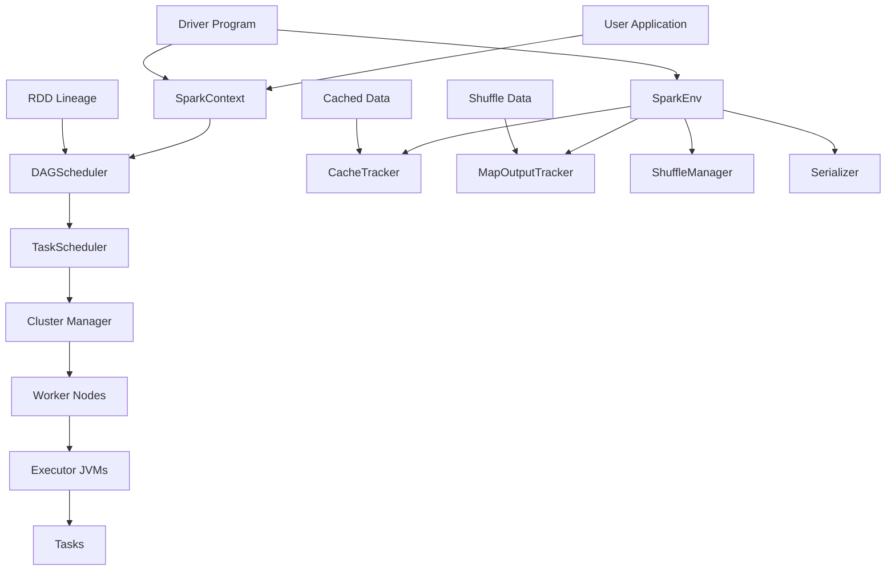

## Core Components Integration

### 1. Driver Program Architecture

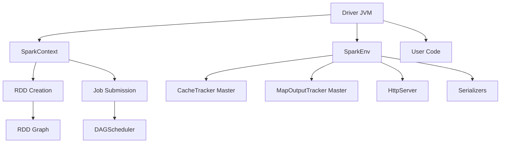

### 2. Worker Node Architecture

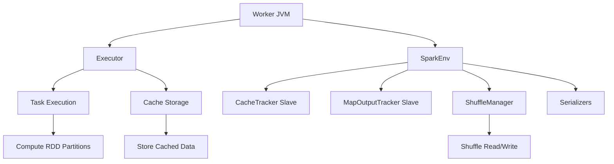

## Data Flow Through the System

### Complete Job Execution Pipeline

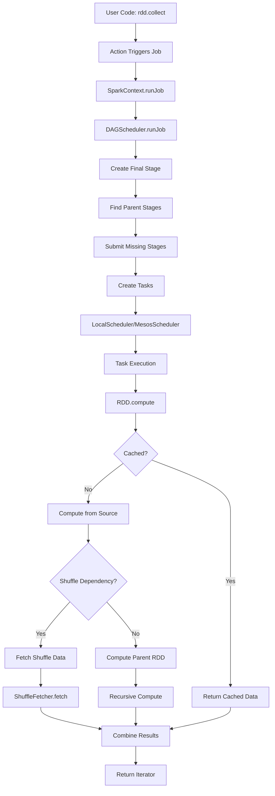

### RDD Computation Flow

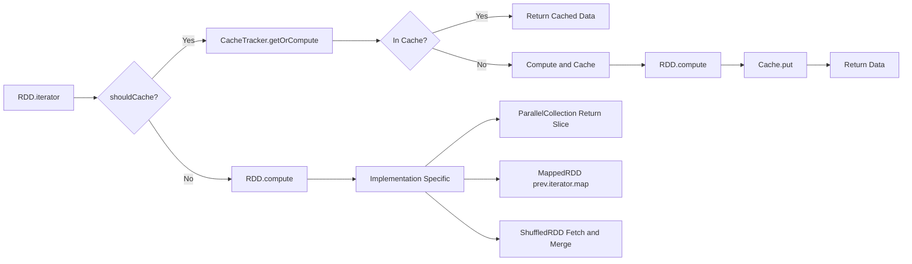

## Memory Management

### Memory Layout in Spark Executors

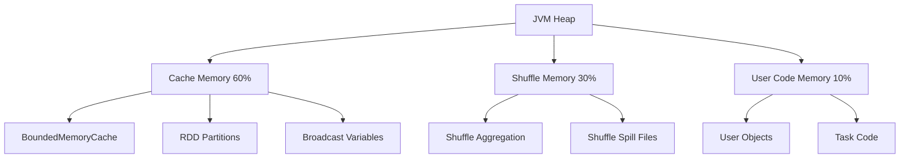

### Cache Management Strategy

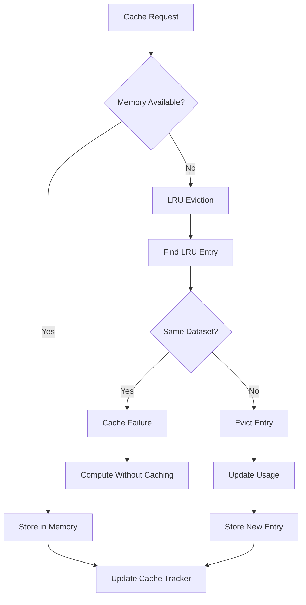

## Network Communication

### Actor-Based Messaging

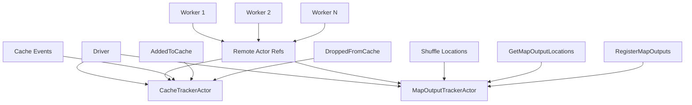

### HTTP-Based Data Transfer

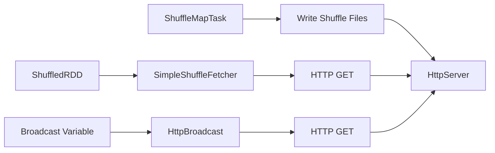

## Fault Tolerance Mechanisms

### Lineage-Based Recovery

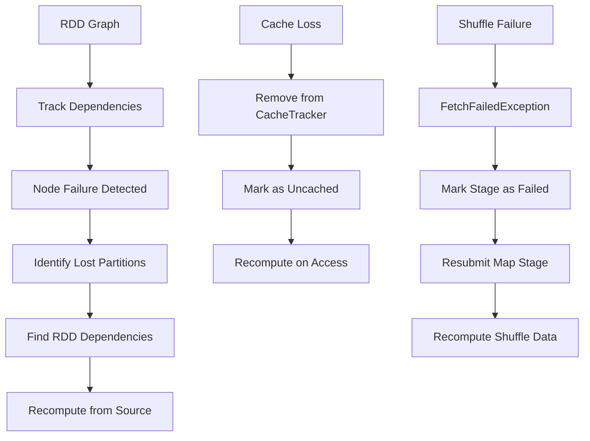

### Generation-Based Consistency

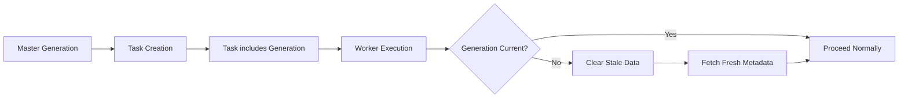

## Optimization Strategies

### Data Locality Optimization

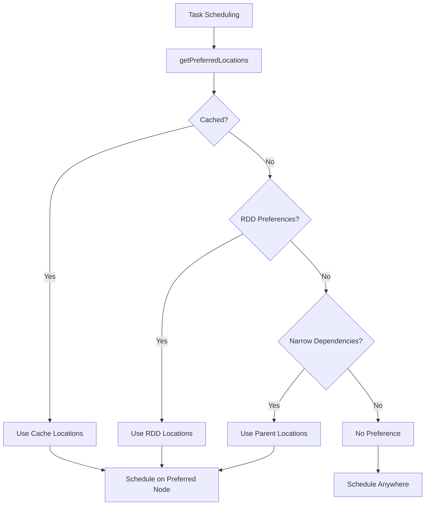

### Pipeline Optimization

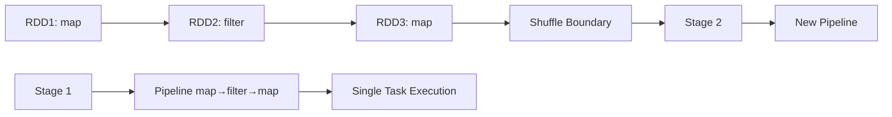

### Memory Optimization

#### Size Estimation
```scala
// From BoundedMemoryCache
val size = SizeEstimator.estimate(value.asInstanceOf[AnyRef])
```

#### Serialization Choice
- **Java Serialization**: Simple, compatible, slow
- **Kryo Serialization**: Fast, compact, setup required

#### Cache Eviction
- **LRU Policy**: Least recently used evicted first
- **Dataset Awareness**: Never evict same dataset
- **Size Tracking**: Monitor memory usage accurately

## Performance Characteristics

### Scaling Properties

| Component | Scaling Behavior | Bottlenecks |
|-----------|------------------|-------------|
| Driver | Single node | Memory for lineage, network for results |
| Tasks | Linear | CPU cores, memory per executor |
| Shuffle | O(M×R) | Network bandwidth, disk I/O |
| Cache | Memory bound | GC pressure, eviction overhead |

### Latency Sources

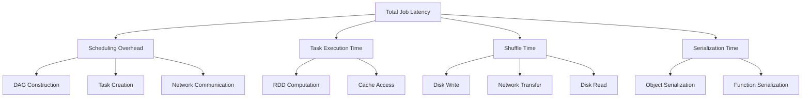

## Configuration and Tuning

### Key Parameters

#### Memory Configuration
```
spark.executor.memory=2g
spark.boundedMemoryCache.memoryFraction=0.6
spark.shuffle.memoryFraction=0.3
```

#### Serialization Configuration
```
spark.serializer=spark.KryoSerializer
spark.kryoserializer.buffer.mb=24
spark.kryo.registrator=MyRegistrator
```

#### Parallelism Configuration
```
spark.default.parallelism=8
spark.sql.shuffle.partitions=200
```

### Monitoring and Debugging

#### Built-in Metrics
- **Job Progress**: Stages, tasks completion
- **Memory Usage**: Cache usage, GC statistics  
- **Shuffle Statistics**: Read/write bytes, fetch time
- **Task Metrics**: Execution time, locality

#### Log Analysis
- **Driver Logs**: Job submission, scheduling decisions
- **Executor Logs**: Task execution, cache operations
- **Network Logs**: Shuffle fetch operations

## Evolution and Extension Points

### Pluggable Components

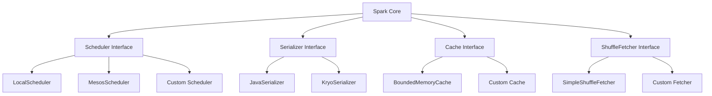

### Extension Mechanisms

#### Custom RDD Types
```scala
class MyCustomRDD[T](sc: SparkContext, data: MyDataSource)
  extends RDD[T](sc) {
  
  override def splits: Array[Split] = // Custom partitioning
  override def compute(split: Split): Iterator[T] = // Custom computation
  override val dependencies: List[Dependency[_]] = // Custom dependencies
}
```

#### Custom Partitioners
```scala
class MyPartitioner(numParts: Int) extends Partitioner {
  def numPartitions: Int = numParts
  def getPartition(key: Any): Int = // Custom partitioning logic
}
```

## Comparison with Other Systems

### vs. MapReduce
- **Iterative Processing**: In-memory caching vs. disk-based
- **Programming Model**: Rich API vs. map-reduce only
- **Performance**: Lower latency, higher throughput

### vs. Stream Processing
- **Batch vs. Stream**: Micro-batch vs. true streaming
- **Latency**: Higher latency, higher throughput
- **Fault Tolerance**: Lineage vs. checkpointing

## Future Considerations

### Potential Improvements
- **Shuffle Optimization**: Reduce network overhead
- **Memory Management**: Better spilling, compression
- **Scheduling**: Dynamic resource allocation
- **SQL Integration**: Catalyst optimizer integration

### Scalability Limits
- **Driver Bottleneck**: Centralized scheduling and lineage
- **Shuffle Complexity**: Quadratic network communication
- **Memory Pressure**: GC overhead with large heaps

This architecture provides the foundation for Spark's success in big data processing, balancing simplicity, performance, and fault tolerance through careful design of its core abstractions and execution model.